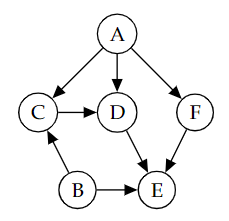

# bayesian-networks-python

A simple Python implementation of Bayesian Networks (BN). Not the most efficient
implementation, but it's simple and it works.

## Features

- [x] Add nodes
- [x] Add edges
- [x] Check colliders
- [x] Check unblocked paths
- [x] Check d-separation
- [x] Check conditional independence
- [ ] Check Markov blanket
- [ ] Check Markov equivalence

## Usage

Clone the repository and navigate to the project directory.

```bash
git clone https://github.com/jiemingyou/bayesian-networks-python.git
cd bayesian-networks-python
```

Run the main script:

```bash
python3 src/network.py
```

## Example

Here's an example of how to assess the conditional independence between
$`C \perp \!\!\! \perp E \mid B, D`$ given the following Bayesian Network:

<p align="center">
  
</p>

```python
from src.network import BayesianNetwork

# Initiate the network
bn = BayesianNetwork()

# Add the nodes
bn.add_node("A")
bn.add_node("B")
bn.add_node("C")
bn.add_node("D")
bn.add_node("E")
bn.add_node("F")

# Add the directed edges
bn.add_edge("A", "C")
bn.add_edge("A", "D")
bn.add_edge("A", "F")
bn.add_edge("B", "C")
bn.add_edge("B", "E")
bn.add_edge("C", "D")
bn.add_edge("D", "E")
bn.add_edge("F", "E")

# Calculate the d-separation
bn.is_d_separated("C", "E", ["B", "D"])

# Returns: (False , {unblocked set})
```
